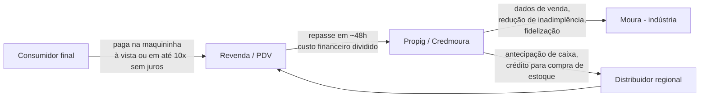
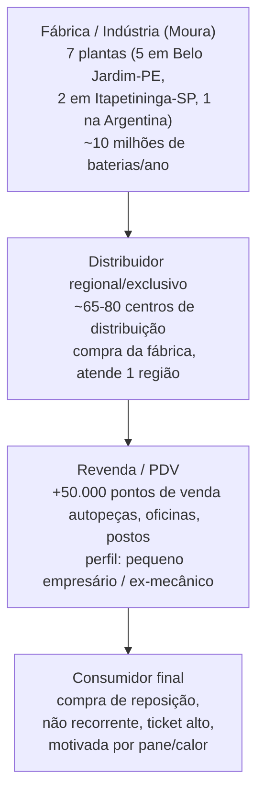
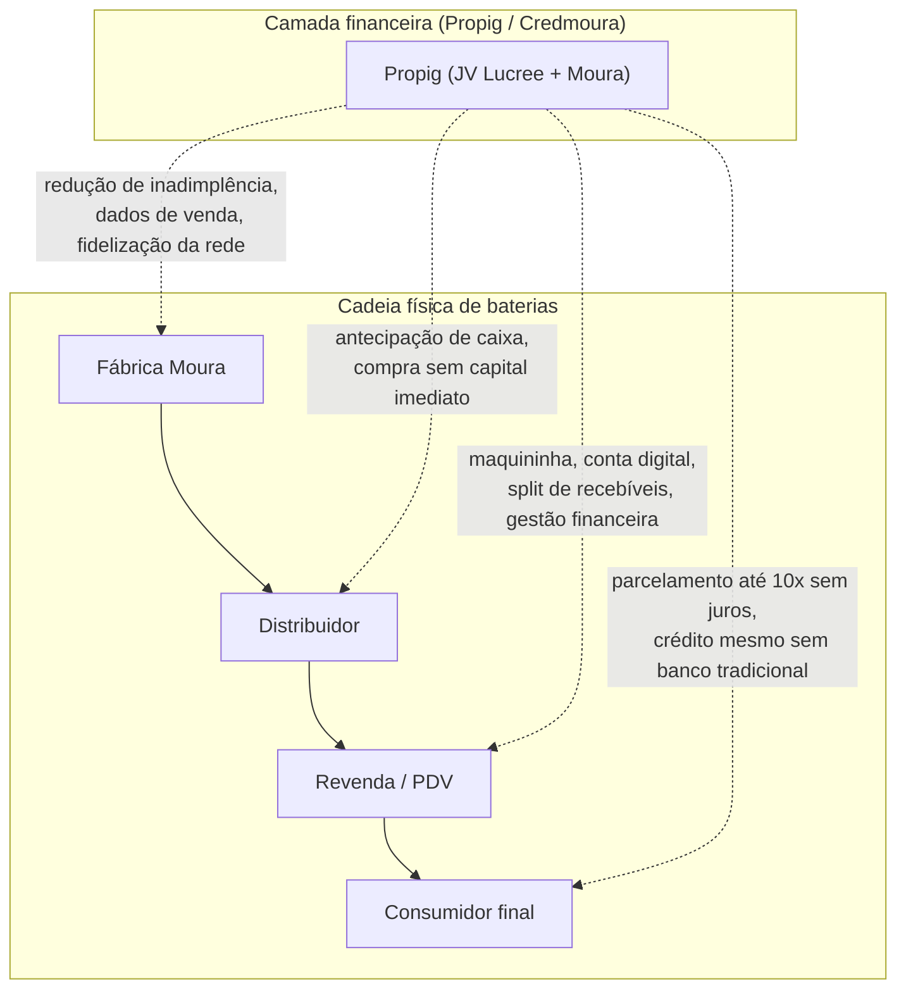

# Ecossistema Propig / Credmoura / Rede Moura

> Mapeamento construído a partir de (a) pesquisa em fontes públicas na internet e
> (b) cruzamento com o que foi dito pelo time Propig/Moura nas transcrições de
> `kickoff/repasse-interno-mjv_transcricao.txt` (08/09) e
> `kickoff/kickoff-oficial-cliente_transcricao.txt` (09/09).
>
> Convenção usada abaixo: **[confirmado]** = fato com fonte pública citada;
> **[kickoff]** = dito pelo time Propig/Moura nas reuniões; **[inferência]** =
> dedução a partir do padrão do setor, sem fonte primária que confirme
> especificamente para a Moura/Propig — tratar com cautela.

## 1. O que é a Propig

- É uma **joint venture entre a fintech Lucree e o Grupo Moura**, fabricante de
  baterias fundado em 1957 e maior player de acumuladores da América Latina.
  Criada para atender a rede de **~50 mil revendedores de baterias** da Moura.
  **[confirmado]** — [Brazil Journal](https://braziljournal.com/moura-gigante-das-baterias-investe-na-lucree/)
- A Moura investiu **R$ 50 milhões** na Lucree para viabilizar a joint venture —
  o primeiro investimento de venture capital da história da Moura.
  **[confirmado]** — [Brazil Journal](https://braziljournal.com/moura-gigante-das-baterias-investe-na-lucree/)
- Fundação em **2019**, sede em **Recife (PE)**, no ecossistema **Porto
  Digital**. Porte pequeno (11–50 funcionários). Hoje é descrita no LinkedIn
  como "responsável pelo Programa CREDMOURA do Grupo Moura".
  **[confirmado]** — [Propig — LinkedIn](https://br.linkedin.com/company/propig)
- Metas de crescimento divulgadas por volta de 2021: transacionar R$ 1 bi
  naquele ano e multiplicar por 5 até 2024 (~R$ 5 bi). **[confirmado]** —
  [Brazil Journal](https://braziljournal.com/moura-gigante-das-baterias-investe-na-lucree/)
- No kickoff (09/09), o time Propig citou TPV atual de **~R$ 1,3 bi** e
  **crescimento de ~30% ao ano** (mercado geral cresce ~10%/ano) — números
  mais recentes que os de imprensa e não encontrados em fonte pública
  independente. **[kickoff]**
- Relação societária exata (% Moura x % Lucree no capital da Propig) **não
  encontrada** em fonte pública.

## 2. O que é o Credmoura e como funciona

Credmoura é a marca/produto operado pela Propig dentro da rede Moura.

- Começa como **maquininha de cartão (POS)** física instalada nas revendas,
  mas o pacote é mais amplo: inclui **conta digital com cartão de crédito
  associado** (sem precisar de banco tradicional), possibilidade de
  **vincular múltiplos estabelecimentos a uma única maquininha**, e **split
  de pagamento** entre recebedores. **[confirmado]** — [Brazil Journal](https://braziljournal.com/moura-gigante-das-baterias-investe-na-lucree/);
  app "CREDMOURA" na Google Play
- **Parcelamento ao consumidor final**: até **10x sem juros** na compra de
  baterias/produtos. O custo desse financiamento é **dividido entre revenda,
  indústria (Moura) e/ou consumidor** — evita que o custo de antecipação
  pese só sobre a revenda. **[confirmado]** — [Brazil Journal](https://braziljournal.com/moura-gigante-das-baterias-investe-na-lucree/)
- Existe também um canal digital: portal do cliente, checkout online
  "Clique Pague" e simulador — ou seja, o produto não é só a maquininha
  física. **[confirmado, via subdomínios propig.com.br]**
- **Prazo de repasse**: relatos públicos de usuários apontam prazo declarado
  de 48h para o valor cair na conta do revendedor, com reclamações de
  atrasos de até 96h. **[confirmado como reclamação pública — não é dado
  oficial da empresa, tratar como evidência de operação real, não como
  norma]** — [Reclame Aqui](https://www.reclameaqui.com.br/propig/maquineta-propig-da-empresa-moura-baterias_AbXsmfPmpGZ987pB/)
- Quem assume o risco de crédito/inadimplência transação a transação não é
  detalhado publicamente; a formulação institucional fala em "custos
  financeiros divididos" entre os três elos — indício de **risco
  compartilhado**, não 100% em nenhum elo isolado.

### Fluxo simplificado de uma transação

## 3. As três fases de maturidade do produto (relatadas pela Propig no kickoff)

O time Propig descreveu que a adoção do Credmoura pelas revendas passa por
níveis de entendimento, alguns levando de 1 a 6 anos para evoluir — e alguns
distribuidores/revendas ainda hoje não entendem bem o valor. **[kickoff]**

1. **Fase 1 — Redução de inadimplência**: a revenda usa a maquininha em
   clientes "problemáticos" para reduzir risco de calote.
2. **Fase 2 — Aceleração de vendas**: além de reduzir inadimplência, o
   parcelamento ao consumidor acelera a venda (o cliente compra mais porque
   tem mais acesso financeiro, em detrimento do concorrente).
3. **Fase 3 — Fidelização / gestão financeira**: o produto passa a ser uma
   ferramenta de gestão do caixa do pequeno empresário (ex-mecânico que virou
   dono de revenda), que passa a depender do produto no dia a dia — existe
   inclusive um produto mais avançado chamado internamente **"flex"/
   "multiagenda"**.

Essa é hoje uma das perguntas centrais do projeto: ao expandir para novas
indústrias, deve-se **começar do zero (fase 1)** ou já entrar oferecendo o
produto no nível de maturidade atual (fase 3)? **[kickoff]**

## 4. Cadeia de valor da Rede Moura (baterias) — atores e papéis

A Moura opera com rede própria e exclusiva de distribuição — a **Rede
Baterias Moura (RBM)** — com duas camadas claras entre a fábrica e o
consumidor final.

| Elo | Papel / responsabilidade | Fonte |
|---|---|---|
| **Fábrica (Moura)** | P&D, manufatura, garantia nacional, política comercial/preço de tabela, marca, treinamento técnico/comercial da rede, padronização de fachadas dos PDVs | [confirmado, parcial] |
| **Distribuidor regional/exclusivo** | Compra direto da fábrica, é o ponto de contato comercial para quem quer virar revenda (cadastro em 48–72h), atende múltiplos PDVs em sua região, assume estoque/capital de giro para abastecer a rede | [confirmado + inferência de setor] |
| **Revenda / PDV** | Vende ao consumidor final; tipicamente autopeças, oficinas mecânicas, postos; investimento inicial estimado de R$ 30–50 mil, faturamento mensal R$ 30–50 mil, margem líquida 15–30% | [inferência de setor — não confirmado especificamente para Moura] |
| **Consumidor final** | Compra por evento (pane da bateria), não planejada; picos ligados a calor/frio extremos, não a sazonalidade de calendário | [confirmado, parcial] |

Números da rede: mais de **65 centros de distribuição comercial** no Brasil,
Argentina e Uruguai (com parceiros também no Paraguai, Reino Unido e
Portugal), e **mais de 50 mil pontos de venda** — este último número
confirmado também pela cobertura da joint venture Propig/Lucree, que cita
justamente esses "50 mil revendedores" como público-alvo do produto
financeiro. **[confirmado]**

### Programas de relacionamento da Moura com a rede (além do Credmoura)

- **Programa Fidelidade Moura**: pontos para balconista/aplicador a cada
  bateria vendida, trocáveis por prêmios.
- **Campanha "Visite a Moura"**: viagens anuais à fábrica em Pernambuco.
- **Treinamento "Vendedor Líder"** e padronização visual dos PDVs.

## 5. Onde a Propig/Credmoura entra na cadeia

O Credmoura não substitui nenhum elo — ele se insere **transversalmente**,
oferecendo um instrumento financeiro que toca os três elos comerciais
(distribuidor, revenda, consumidor final) e devolve valor para a indústria
(Moura) na forma de dados, fidelização e redução de inadimplência da rede.

## 6. O desafio central de posicionamento (relatado no kickoff)

Este é o ponto mais insistido pelo time Propig na reunião de kickoff oficial
(09/09), e é a razão de existir do projeto de consultoria: **[kickoff]**

- O mercado (e até funcionários internos) confundem a Propig com "empresa de
  maquininha", entrando no "universo de taxas e MDR" e sendo comparada com
  adquirentes genéricas (Cielo, Stone, Itaú) — quando o objetivo é ser vista
  como **ferramenta de aceleração de vendas / plataforma de inteligência de
  crescimento** para o parceiro, e não como concorrente de maquininha.
- Hoje o programa **gera muito mais valor para a Moura do que para a Propig
  financeiramente** — "cara" para o cliente final, mas de baixa margem para
  a Propig, que não retém capital dentro de casa. Empacotar essa proposta de
  valor de forma que gere receita sustentável para a Propig é um dos
  objetivos centrais do projeto.
- Risco financeiro citado como exemplo: um produto empacotado com **taxa
  única**, mas se o cliente transacionar muito em **débito**, a Propig não
  ganha dinheiro com aquela transação — ou seja, o desenho do produto
  precisa considerar o mix de forma de pagamento.
- KPIs típicos do setor de maquininhas (ex.: SLA de entrega em 24h, tempo de
  transação em 2–5 segundos, importante para filas de padaria/supermercado)
  **não são relevantes** para o negócio da Propig — o cliente (dono de
  revenda de bateria/pneu/tinta) não tem essa urgência operacional. A Propig
  precisa deixar isso claro na proposta de valor em vez de tentar competir
  nesses KPIs.
- Quem precisa entender e comprar a proposta é, na visão do time Propig, o
  **CEO/presidente da operação** (dono do distribuidor), porque o produto
  tem impacto holístico (financeiro + comercial + logístico), não apenas em
  uma área isolada.

## 7. Atores / pessoas-chave

**Lado Moura / Propig / Lucree** (fontes públicas):

| Nome | Papel |
|---|---|
| Eduardo França | Sócio-diretor/fundador da Lucree Soluções Inteligentes |
| Tiago Tasso | CFO do Grupo Moura / Diretor Geral da Acumuladores Moura; ~20 anos na empresa; articulou a parceria com a Lucree |
| Elisa Correia | Diretora geral da Rede Moura Brasil e Cone Sul |
| Antonio Junior | Diretor geral de Baterias |
| Fernando Castelão | Diretor geral da Divisão de Lítio; diretor de Logística e Suprimentos |

**Time do projeto citado no kickoff (09/09)** — não confirmado por fonte
pública, apenas o que foi dito na reunião: **[kickoff]**

- **Tasso** (mesmo Tiago Tasso acima) — conduz o projeto pelo lado
  financeiro/estratégico da Moura/Propig.
- **Dani** — produto.
- **Bruno** — também acompanha produto, junto com Dani.
- **André** — parte financeira, junto com Tasso.
- **Rui** — comercial, lidera contatos com revendas/distribuidores; estava
  viajando (implementação de CRM em Cascavel) no dia do kickoff.
- Time comercial adicional envolvido em agendamentos com distribuidores e
  revendas para as entrevistas de campo.

Não foi encontrado, em fonte pública, um "CEO da Propig" nomeado como tal —
a liderança pública aparece atribuída à dupla Lucree (Eduardo França) e
Moura (Tiago Tasso como patrocinador executivo do investimento), sugerindo
governança compartilhada da joint venture.

## 8. Lacunas / pontos que precisam validação em campo

- Percentual de participação societária Moura x Lucree na Propig.
- TPV atual exato e taxa de crescimento — os R$1,3 bi/30% citados no kickoff
  não têm fonte pública independente ainda.
- Detalhamento contratual de como o risco de inadimplência é de fato
  dividido entre revenda, Moura e consumidor.
- Se existe hoje algum caso publicado (fora da própria Moura) de um produto
  Credmoura-like funcionando em outra indústria — não encontrado; o
  discurso da Propig no kickoff é de que **ainda não conseguiram "emplacar"**
  esse modelo fora da Moura nos últimos ~2 anos de tentativa (dito na
  reunião de repasse interno de 08/09).

## Fontes principais

- [Brazil Journal — "Moura, gigante das baterias, investe na Lucree"](https://braziljournal.com/moura-gigante-das-baterias-investe-na-lucree/)
- [Propig — LinkedIn](https://br.linkedin.com/company/propig)
- [Reclame Aqui — Propig](https://www.reclameaqui.com.br/propig/)
- [Diário de Pernambuco — plantas industriais Moura](https://www.diariodepernambuco.com.br/noticia/economia/2022/11/baterias-moura-sete-plantas-industriais-em-quatro-paises.html)
- [InfoMoney — história da Moura](https://www.infomoney.com.br/business/baterias-moura-a-historia-da-empresa-com-mais-de-60-anos-e-cheia-de-energia/)
- [Automotive Business — quinta fábrica Moura em Pernambuco](https://www.automotivebusiness.com.br/noticias/moura-inaugura-sua-quinta-fabrica-em-pernambuco-a-sexta-no-brasil)
- Transcrições internas: `kickoff/repasse-interno-mjv_transcricao.txt` e
  `kickoff/kickoff-oficial-cliente_transcricao.txt`
