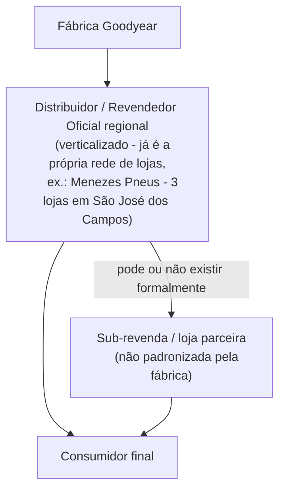

# Mapeamento para expansão: Goodyear e DecoColors

> Objetivo do projeto (dito no kickoff oficial de 09/09): replicar a proposta
> de valor do Credmoura — com os ajustes necessários — para outras
> indústrias fora da Moura. As duas primeiras escolhidas para o piloto de
> pesquisa de campo (entrevistas de 21 a 25/09) são **Goodyear** (pneus) e
> **DecoColors** (tintas). Este documento mapeia como funcionam essas duas
> cadeias hoje e onde uma solução "tipo Credmoura" entraria.
>
> Convenção: **[confirmado]** = fato com fonte pública citada; **[kickoff]**
> = dito pelo time Propig/Moura nas reuniões; **[inferência]** = dedução a
> partir do padrão do setor, sem confirmação específica — tratar com cautela.

## 1. Por que Goodyear e DecoColors — a hipótese da Propig

No kickoff, a Propig explicou a lógica de escolha: procuram indústrias com
estrutura de cadeia parecida com a da Moura — **fábrica → distribuidor →
revenda → consumidor final** — e com um padrão de compra em que "ninguém
quer comprar" o produto por impulso (bateria, pneu, tinta são compras de
necessidade ou de reforma, não de consumo recorrente), mas o ticket é alto o
suficiente para justificar parcelamento/crédito. **[kickoff]**

> "A mesma coisa acontece com a Godia [Goodyear], com a DecoColors, quando
> você quer pintar uma casa... é pontual." — Speaker 5 (Propig), kickoff 09/09

## 2. Goodyear — cadeia de distribuição de pneus no Brasil

### 2.1 Estrutura do setor

- Produção nacional concentrada em 12 fábricas de 5 grupos: Goodyear,
  Pirelli, Bridgestone/Firestone, Michelin e Continental. Vendas se dividem
  em montadoras (~26%), exportação e **reposição** (~42%, via revendas).
  **[confirmado]** — [ANIP](https://www.anip.org.br/)
- Em 2025 o mercado de reposição recuou 7,5% e a participação da indústria
  nacional caiu de 73% (2020) para 41% (2025), pressionada por pneus
  importados. **[confirmado]** — [AutoIndústria](https://www.autoindustria.com.br/2026/01/20/venda-de-pneus-produzidos-no-brasil-encolhe-58-em-2025/), [AutoData](https://www.autodata.com.br/noticias/2026/01/20/vendas-de-pneus-nacionais-caem-6-em-2025/98831/)

### 2.2 Canais de venda da Goodyear

- Rede de **revendedores oficiais**: mais de 1.000 pontos de venda no país.
  **[confirmado]** — [goodyear.com.br](https://www.goodyear.com.br/encontre-um-distribuidor)
- Linha caminhão/frota: rede de recapadores autorizados e "Truck Centers".
  **[confirmado]**
- E-commerce (desde 2021, inicialmente só capital paulista), com retirada e
  instalação nos revendedores oficiais — canal complementar, não substitui
  a rede física. **[confirmado]**
- **Padrão observado repetidamente em releases regionais**: a Goodyear
  anuncia parceria com uma empresa local chamada "revendedor oficial", que
  **já opera várias lojas próprias** na região (ex.: Sópneus em
  Piracicaba/SP desde 2016; Top Pneus em Parnamirim/RN e João Pessoa/PB;
  Norte Sul Pneus em Goiânia, 11+ anos de parceria, 3ª loja própria; BR
  Pneus em Minas Gerais com Truck Centers). **[confirmado, padrão
  repetido]**

### 2.3 Cruzamento direto com o caso citado no kickoff

O kickoff menciona um distribuidor em **São José dos Campos**, "distribuidor
exclusivo" que atende a região, descrito como "CEO da operação" (olha
financeiro, comercial, logístico — visão holística). Isso **bate exatamente**
com o padrão confirmado na pesquisa: em São José dos Campos, a **Menezes
Pneus** é revendedor oficial Goodyear há 5 anos, com **3 unidades próprias**
na cidade. **[confirmado + kickoff — cruzamento direto]**

Também no kickoff, o time Propig descreve que, nesse modelo, **não existe
uma camada formal de "revenda" abaixo do distribuidor** cadastrada pela
fábrica — a relação comercial inicial da Goodyear é direta **fábrica ↔
distribuidor**, e o próprio distribuidor pode ou não repassar a revendas
próprias/terceiras, mas isso não é padronizado pela fábrica:

> "Não vai chegar o produto na revenda, ele só vai ficar essa relação entre
> os dois [fábrica-distribuidor]... a Godia não tem essa relação com a
> revenda, é só do distribuidor mesmo." — Speaker 3 (Propig), kickoff 09/09

Isso é consistente com o que a pesquisa encontrou: o "distribuidor exclusivo"
da Goodyear tende a ser, ele mesmo, **uma rede varejista verticalizada** (o
distribuidor É a loja, com múltiplas unidades próprias), diferente de um
atacadista puro que abastece dezenas de revendas independentes menores.
**[inferência, mas fortemente sustentada pelo padrão observado + kickoff]**

No kickoff surge inclusive uma discussão sobre se o distribuidor é também um
"PDV" (ponto de venda direto ao consumidor final) ou puramente um elo B2B —
os presentes concluem que ele é um **híbrido**: atende consumidor final
diretamente em algumas praças e atua como distribuidor regional em outras.

### 2.4 Perfil dos elos e crédito hoje

| Elo | Perfil / dinâmica hoje |
|---|---|
| Distribuidor/revendedor oficial | Empresa de porte médio/regional, frequentemente décadas de atuação, concentra território; **[inferência]** multimarquismo é comum na ponta em concorrentes (ex.: lojas que vendem Michelin + Pirelli + Goodyear + Continental) — sugerindo que exclusividade de marca não é a norma do setor mesmo quando há vínculo de "revendedor oficial" |
| Consumidor final | Já usa **parcelamento no cartão de crédito da própria loja**, tipicamente 6–12x sem juros — hábito de crédito já consolidado nesse elo, diferente de um cenário sem alternativa |
| Crédito B2B (fábrica→distribuidor) | **[inferência de padrão setorial]** boleto faturado 30/60/90 dias, com limite de crédito crescente por histórico |
| Giro de estoque | Recomendação de mercado é manter estoque enxuto (poucas unidades por medida) e evitar formas de pagamento arriscadas (cheque) — indício de que **capital de giro é uma dor real na ponta**, mesmo sem dado oficial |

### 2.5 Implicações para replicar o Credmoura

- **Ponto favorável**: se o risco de crédito pulverizado entre muitas
  revendas pequenas é o problema que o Credmoura resolve na Moura, esse
  risco pode ser **estruturalmente menor** no piloto Goodyear, porque o
  "distribuidor" já é verticalizado (menos CNPJs, maior porte cada) — logo
  o produto talvez precise ser reposicionado como ferramenta de **gestão de
  capital de giro e aceleração de venda ao consumidor final**, mais do que
  como redutor de inadimplência entre elos B2B.
- **Ponto de atenção**: o consumidor final já tem parcelamento consolidado
  no cartão da própria loja — qualquer solução concorreria com um hábito já
  formado, diferente do cenário battery onde a maquininha Credmoura parece
  ter sido a principal via de parcelamento.
- **Lacuna a validar em campo**: se existe ou não uma camada real e
  numerosa de sub-revendas abaixo do distribuidor Goodyear — a resposta
  muda o desenho todo do produto (B2B2C vs. B2C direto).

## 3. DecoColors — cadeia de distribuição de tintas no Brasil

### 3.1 Identificação da empresa — ressalva importante

**Não foi encontrada** nenhuma empresa registrada exatamente como
"DecoColors"/"Deco Colors" em fontes públicas. A correspondência mais
próxima é a **Decor Colors**, rede de franquias de tintas especiais
(efeitos decorativos, texturas, impermeabilizante), fundada em 2021 por
Leonardo Arruda, que recebeu o maior aporte da história do Shark Tank
Brasil (R$ 10 milhões, de João Appolinário, fundador da Polishop).
**[confirmado, mas identidade não 100% certa]** — [Exame](https://exame.com/negocios/joao-appolinario-investiu-nesta-fabrica-de-tintas-no-shark-tank-hoje-franquia-fatura-r300-milhoes/)

- Mais de **600 lojas** no Brasil, 34ª maior franquia do país (Ranking ABF
  2025), faturamento projetado em torno de **R$ 500 milhões** (2024/2025).
  **[confirmado]** — [Mercado&Consumo](https://mercadoeconsumo.com.br/09/04/2025/franquias/saiba-quanto-custa-abrir-uma-franquia-da-decor-colors-que-ja-tem-mais-de-600-lojas-no-pais/)
- Investimento do franqueado a partir de R$ 35 mil, payback estimado 6–18
  meses. **[confirmado]**
- Existe uma pessoa jurídica "Decor Colors Tintas Ltda" em Salto/SP,
  provavelmente a fábrica/holding por trás da marca. **[confirmado]**

**Isto muda a leitura do caso**: se for de fato a Decor Colors, a "indústria"
já opera como **rede de franquias verticalizada** (fábrica + rede de lojas
próprias/franqueadas com a mesma marca), não como um fabricante clássico
(tipo Suvinil/Coral) vendendo por distribuidores multimarcas independentes.
Isso deve ser **confirmado em campo** antes de assumir qualquer premissa.
No kickoff, a empresa aparece apenas como "DecoColors", com **revendas**
sendo agendadas para entrevista (ainda sem contatos fechados no momento do
kickoff) — compatível com o modelo de franquia (a "revenda" seria a loja
franqueada). **[kickoff]**

### 3.2 Estrutura geral do setor de tintas (se não for franquia verticalizada)

Padrão clássico do setor: **fábrica → distribuidor/atacadista (nem sempre
presente) → varejo (loja especializada, home center ou material de
construção) → consumidor final ou pintor profissional**. **[confirmado,
padrão geral]**

- Fabricantes grandes (Sherwin-Williams/Suvinil, AkzoNobel/Coral, PPG, Sika)
  vendem via distribuidores regionais e diretamente a grandes redes de
  varejo.
- Movimento de verticalização do canal: a Sherwin-Williams tem programas
  como "Revenda Master" (converte loja multimarcas em loja exclusiva, com a
  fabricante cobrindo parte da reforma) — mostrando que a indústria de
  tintas está caminhando para o mesmo tipo de verticalização já observado
  na Goodyear. **[confirmado]** — [Sherwin-Williams](https://sherwin.com.br/conheca-a-sherwin/revenda-master/)
- Elemento estrutural chave do varejo de tinta: a **máquina tintométrica**,
  que produz a cor sob encomenda a partir de bases + pigmentos — reduz a
  necessidade de estoque de milhares de latas prontas, mas exige capital de
  giro em insumos. **[confirmado]**

### 3.3 Perfil do comprador — a ambiguidade do decisor

Ponto estruturalmente diferente de baterias e pneus: no setor de tintas
coexistem três perfis de comprador, e **quem decide não é sempre quem
paga**:

- Pessoa física reformando a casa — compra pontual, baixa frequência
  (bate com a fala do kickoff: "quando você quer pintar uma casa é
  pontual").
- **Pintor profissional**, que compra em nome do cliente final e
  frequentemente concentra a decisão técnica de marca/produto, mesmo sem
  ser quem paga — muitas lojas têm programas de fidelidade para pintores
  (desconto no balcão + comissão sobre compras do cliente indicado).
  **[confirmado]** — [CB Sistemas](https://www.cbsistemas.com.br/como-fidelizar-pintores-loja-de-tintas/)
- Construtoras/incorporadoras — compra em volume, ciclo de decisão distinto.

Essa ambiguidade (decisor ≠ pagador) é um ponto de atenção real para
desenhar qualquer produto de crédito: **quem seria o "tomador" natural do
crédito Credmoura-like** — o pintor, o cliente final, ou a loja/revenda?
**[inferência — pergunta a validar em campo]**

### 3.4 Crédito hoje na cadeia de tintas

- Ao consumidor final: parcelamento no cartão da própria loja, em geral até
  24x. **[confirmado]**
- Existe uma linha setorial de crédito para material de construção ("CDC
  João de Barro", Bradesco, exclusiva para lojas associadas à Anamaco).
  **[confirmado]**
- Da fabricante para a revenda: não foi encontrado um produto de crédito de
  giro recorrente tipo "maquininha" — o que existe documentado é **capex
  compartilhado** (fabricante cofinancia reforma de loja em troca de
  exclusividade, como no programa Revenda Master), um mecanismo de
  fidelização de canal via investimento, não de crédito de vendas
  recorrente. **[confirmado]**

### 3.5 Implicações para replicar o Credmoura

- **Ponto favorável**: se a DecoColors for de fato uma rede de franquias
  verticalizada (Decor Colors), a estrutura de canal já é parecida com a
  de um "distribuidor único com múltiplas lojas próprias" — mais fácil de
  negociar um piloto único do que convencer centenas de revendedores
  independentes.
- **Ponto de atenção estrutural**: a ambiguidade decisor/pagador (pintor
  vs. cliente final) não existe nem em baterias nem em pneus — é
  específica de tintas e precisa ser resolvida antes de desenhar o produto
  de crédito.
- **Ponto de atenção de recorrência**: tinta não tem "prazo de vida útil"
  empurrando recompra como bateria — a única fonte de recorrência é o
  pintor profissional atendendo múltiplos clientes ao longo do tempo.

## 4. Comparativo entre as três cadeias

| Dimensão | Moura (baterias) | Goodyear (pneus) | DecoColors (tintas) |
|---|---|---|---|
| Camada de revenda formal abaixo do distribuidor | Sim — +50 mil PDVs pulverizados **[confirmado]** | Não confirmada / distribuidor tende a ser verticalizado **[kickoff + confirmado]** | Depende se é rede de franquia (Decor Colors) — nesse caso a "loja franqueada" já é a própria revenda **[a confirmar]** |
| Quem decide a compra | Consumidor final (motorista) | Consumidor final, ou o próprio dono do distribuidor/loja | Pintor profissional (decide) vs. cliente final (paga) — decisor ambíguo |
| Recorrência de compra | Reposição por falha (não recorrente, mas previsível) | Reposição por desgaste (ciclo mais longo, ticket maior) | Compra pontual (reforma), recorrência só via pintor profissional |
| Crédito ao consumidor já existente | Parcelamento via maquininha Credmoura (parece ser via principal) | Parcelamento já consolidado no cartão da própria loja | Parcelamento já consolidado no cartão da própria loja (até 24x) |
| Risco de inadimplência pulverizado | Alto (muitos PDVs pequenos) | Potencialmente menor (distribuidor verticalizado, maior porte) | A confirmar (depende do formato real da empresa) |
| Mecanismo de fidelização hoje | Programa Fidelidade Moura, viagens, Credmoura | — (não identificado programa específico) | Capex compartilhado (Revenda/Select Master, setor em geral) |

## 5. Riscos e pontos de atenção transversais (do kickoff)

- **KPIs de maquininha não se aplicam**: SLA de entrega (24h vs. 5 dias da
  Propig) e velocidade de transação (2–5s vs. 30s da Propig) são
  relevantes para adquirentes que atendem padaria/supermercado (fila de
  espera), mas não para a compra de pneu/tinta/bateria — a Propig não
  precisa competir nesses KPIs e deve deixar isso explícito na proposta de
  valor, em vez de ser comparada com eles. **[kickoff]**
- **Risco financeiro de taxa única**: se o produto for empacotado com taxa
  fixa mas o cliente transacionar muito em débito, a Propig não ganha
  margem — o desenho do produto para as novas indústrias precisa
  considerar o mix de forma de pagamento esperado em cada setor.
  **[kickoff]**
- **Quem precisa "comprar" a proposta**: o time Propig insiste que o
  produto só é entendido de forma holística pelo **CEO/presidente/dono da
  operação** — dificilmente financeiro, comercial ou marketing isolados
  vão perceber o valor sozinhos. Isso vale tanto para Goodyear quanto para
  DecoColors. **[kickoff]**
- **Amostra pequena de entrevistas**: apenas 5 entrevistas de campo no
  total (distribuidores + revendas), reduzidas de um escopo maior por
  restrição de tempo/orçamento do projeto — qualquer conclusão de campo
  deve ser tratada como hipótese a validar, não como fato definitivo.
  **[kickoff]**
- **Dependência de terceiros para agendamento**: Goodyear e DecoColors são
  clientes/relações comerciais externas à Moura, com menor controle de
  agenda do que os distribuidores da própria Moura — risco de atraso ou
  cancelamento citado explicitamente como o maior risco do projeto no
  curto prazo. **[kickoff]**

## 6. Perguntas abertas para as entrevistas de campo (21–25/09)

Com base nas lacunas identificadas nesta pesquisa:

1. **Goodyear**: existe hoje alguma camada formal de sub-revenda abaixo do
   distribuidor, ou o distribuidor vende só para si mesmo/consumidor final?
   Quem assume o risco de crédito quando o distribuidor financia o
   consumidor final?
2. **Goodyear**: o distribuidor entrevistado em São José dos Campos
   representa múltiplas marcas de pneu (como é comum no setor) ou é
   exclusivo Goodyear? Isso muda a disposição dele a adotar um produto
   financeiro de marca única.
3. **DecoColors**: a empresa é de fato uma rede de franquias (modelo
   Decor Colors) ou uma distribuidora/fabricante tradicional? Isso muda
   completamente o desenho do piloto.
4. **DecoColors**: quem efetivamente decide a compra na ponta — o pintor
   profissional ou o cliente final? Quem seria o tomador natural de um
   crédito tipo Credmoura?
5. **Ambas**: qual o mix atual de forma de pagamento (crédito, débito,
   dinheiro, PIX) na ponta, para dimensionar o risco financeiro de uma
   eventual taxa única?
6. **Ambas**: quem, na estrutura da empresa entrevistada, teria poder de
   decisão real para adotar o produto — confirma se é sempre o
   dono/CEO, como hipotetizado pela Propig?

## Fontes principais

- [ANIP — Associação Nacional da Indústria de Pneumáticos](https://www.anip.org.br/)
- [AutoIndústria — vendas de pneus 2025](https://www.autoindustria.com.br/2026/01/20/venda-de-pneus-produzidos-no-brasil-encolhe-58-em-2025/)
- [Goodyear Brasil — encontre um distribuidor](https://www.goodyear.com.br/encontre-um-distribuidor)
- [Exame — Decor Colors / Shark Tank](https://exame.com/negocios/joao-appolinario-investiu-nesta-fabrica-de-tintas-no-shark-tank-hoje-franquia-fatura-r300-milhoes/)
- [Mercado & Consumo — franquia Decor Colors](https://mercadoeconsumo.com.br/09/04/2025/franquias/saiba-quanto-custa-abrir-uma-franquia-da-decor-colors-que-ja-tem-mais-de-600-lojas-no-pais/)
- [Sherwin-Williams — Revenda Master](https://sherwin.com.br/conheca-a-sherwin/revenda-master/)
- Transcrições internas: `kickoff/repasse-interno-mjv_transcricao.txt` e
  `kickoff/kickoff-oficial-cliente_transcricao.txt`
